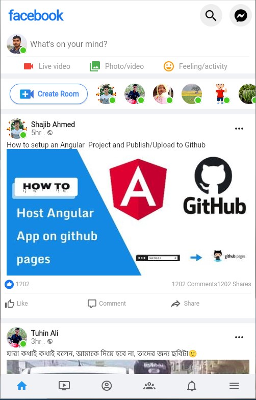

# facebook_ui_design

## 👋Hello, I`am Sujon Ali
 </b>

It is my Facebook_UI design practice project. You will get my full project code. 
 </b>

## 👨‍🏫 About me  

 I am a student of honors 4`th year of Kushtia Govt. College. I am learning App Development on Flutter. I am also learning Web Development. Now, I have completed my App development course(Skill Development Mobile Game and Application Project) that is Govt. Project. I am tryng to do a job on Software Company. Thanks.

 </b>

<!----> </b>

## My Online Address 
 </b>
                          
